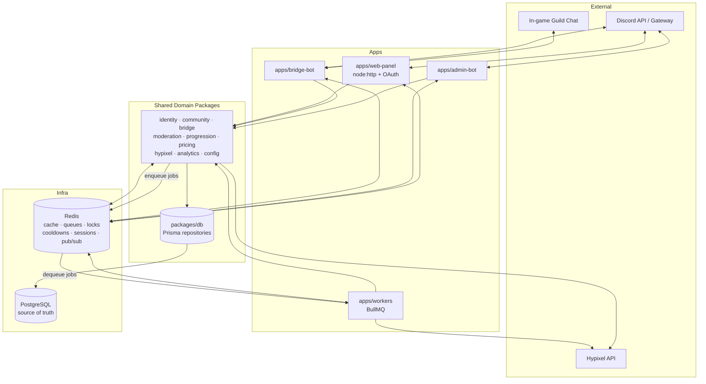

# Architecture — SBR Guild Platform

A TypeScript monorepo with independently deployable **apps** and shared **packages**. Apps are thin process shells (wiring, transport, lifecycle); all domain logic lives in packages so the bots and web panel consume the same code instead of duplicating it.

- **Primary datastore:** PostgreSQL via Prisma (source of truth).
- **Redis:** cache, job queues, cooldowns, distributed locks, ephemeral sessions, and pub/sub event dispatch.
- **Rule:** every package exposes **typed service interfaces + DTOs** (`packages/shared-types`); apps depend on interfaces, not internals.

---

## Monorepo Directory Tree      

```
sbr-platform/
├── package.json                 # workspace root (pnpm workspaces + turbo)
├── pnpm-workspace.yaml
├── turbo.json                   # task pipeline / caching
├── tsconfig.base.json           # shared TS config, path aliases
├── .env.example
├── docker-compose.yml           # local: postgres, redis, apps
│
├── apps/
│   ├── web-panel/               # Control panel — node:http + Discord OAuth
│   │   ├── src/
│   │   │   ├── app/             # routes: config, analytics, ops
│   │   │   ├── api/             # route handlers → shared services
│   │   │   ├── auth/            # OAuth glue → packages/identity
│   │   │   └── server/          # service container / DI wiring
│   │   └── package.json
│   │
│   ├── bridge-bot/              # member-facing Discord + in-game bridge
│   │   ├── src/
│   │   │   ├── discord/         # gateway client, slash commands
│   │   │   ├── ingame/          # Minecraft/guild-chat connector
│   │   │   ├── commands/        # command handlers → services
│   │   │   └── main.ts
│   │   └── package.json
│   │
│   ├── admin-bot/               # staff-facing moderation + admin bot
│   │   ├── src/
│   │   │   ├── discord/
│   │   │   ├── commands/        # mod/admin actions → services
│   │   │   └── main.ts
│   │   └── package.json
│   │
│   └── workers/                 # background job processors (BullMQ)
│       ├── src/
│       │   ├── queues/          # queue definitions
│       │   ├── processors/      # stats-sync, pricing-refresh, analytics-rollup
│       │   ├── schedulers/      # cron/repeatable jobs
│       │   └── main.ts
│       └── package.json
│
└── packages/
    ├── db/                      # Prisma schema, client, migrations, repositories
    │   ├── prisma/schema.prisma
    │   ├── src/repositories/    # typed data-access, no business rules
    │   └── src/index.ts         # exports PrismaClient + repos
    │
    ├── shared-types/            # DTOs, service interfaces, enums, zod schemas
    │   └── src/index.ts
    │
    ├── config/                  # env loading/validation, feature flags, settings service
    │   └── src/index.ts
    │
    ├── identity/                # Discord OAuth, sessions, roles, permission checks
    ├── hypixel/                 # Hypixel API client (rate-limited, cached)
    ├── pricing/                 # item pricing / bazaar / auction valuation
    ├── progression/            # skills, networth, progression computation
    ├── bridge/                  # chat relay domain: routing, formatting, filtering
    ├── moderation/              # mutes/warns/bans, audit log, membership actions
    ├── community/               # guild/member records, roles, onboarding
    └── analytics/               # event ingestion, aggregation, reporting queries
```

---

## Service Boundaries

Each package owns one domain and exposes a **service interface** + **DTOs**. Cross-package calls go through interfaces defined in `shared-types`; no package reaches into another's internals or Prisma models directly (except `db`).

### Infrastructure / cross-cutting packages
- **`packages/db`** — the *only* package that touches Prisma. Exposes typed repositories (e.g. `MemberRepository`, `ModerationRepository`). Business logic never writes raw Prisma queries; it calls repositories.
- **`packages/shared-types`** — the contract layer. DTOs, service interfaces, enums, and zod validation schemas. Has no runtime dependencies on other packages, so everything can depend on it without cycles.
- **`packages/config`** — validated env + runtime settings (feature flags, per-guild config) backed by Postgres and cached in Redis. Provides a `SettingsService` all apps read from.
- **`packages/identity`** — Discord OAuth flow, session issuance (Redis-backed), role resolution, and a `PermissionService` used by the panel and admin-bot to authorize actions.

### Domain packages
- **`packages/hypixel`** — wraps the Hypixel API with rate limiting, retries, and Redis caching. Returns normalized DTOs, never raw upstream payloads.
- **`packages/pricing`** — bazaar/auction valuation. Depends on `hypixel` for raw data; caches computed prices in Redis. Exposes `PricingService`.
- **`packages/progression`** — computes skills, networth, and progression from `hypixel` + `pricing`. Pure-ish domain logic; exposes `ProgressionService`.
- **`packages/bridge`** — chat relay domain: message routing, formatting, filtering, rate/spam rules. Transport-agnostic — apps supply the Discord/in-game adapters; the package decides *what* relays where. Uses Redis pub/sub for fan-out.
- **`packages/moderation`** — mutes, warns, bans, membership actions, and the audit log. Writes through `db`, enforces `identity` permissions, emits analytics events.
- **`packages/community`** — guild/member registry, role mapping, onboarding/linking (Discord ↔ in-game name). Source domain for "who is who."
- **`packages/analytics`** — ingests events (command usage, moderation actions, bridge health), aggregates them (often via workers), and answers reporting queries for the panel.

### Apps (thin shells)
- **`apps/web-panel`** — zero-dep `node:http`. Owns HTTP transport, OAuth callback, and the static browser UI (`client/` → `public/app/`). Delegates all logic to services. See WEB_PANEL.md §0.
- **`apps/bridge-bot`** — owns Discord gateway + in-game connectors; delegates relay/command logic to `bridge`, `progression`, `pricing`.
- **`apps/admin-bot`** — owns staff Discord surface; delegates to `moderation`, `community`, `identity`.
- **`apps/workers`** — owns queue processing/scheduling; runs long/periodic work for `hypixel`, `pricing`, `progression`, `analytics`.

---

## Data Flow

### Architecture diagram



### Representative flows

**1. Member runs a stats command (bridge-bot)**
`Discord/in-game → bridge-bot command handler → ProgressionService`. Service checks Redis for cached progression; on miss, pulls via `hypixel` + `pricing` (also Redis-cached), computes, caches result, and returns a DTO. A cooldown key in Redis prevents spam.

**2. Guild chat relay (bridge-bot)**
In-game message → `bridge` domain applies routing/filter rules → publishes to a Redis channel → bridge-bot's Discord adapter delivers it (and vice-versa). Redis pub/sub decouples the two transports and allows multiple instances.

**3. Staff mutes a member (admin-bot / web-panel)**
`admin-bot or web-panel → identity.PermissionService authorizes → moderation.ModerationService` writes the action + audit entry through `db` to Postgres, sets an ephemeral mute key/cooldown in Redis, and emits an analytics event.

**4. Config change in the panel**
`web-panel → config.SettingsService` writes to Postgres and invalidates/updates the Redis-cached settings; bots read settings from the same cache, so changes take effect without redeploy.

**5. Scheduled data refresh (workers)**
Scheduler enqueues `stats-sync` / `pricing-refresh` jobs on Redis (BullMQ). `workers` pull jobs, call `hypixel`/`pricing`/`progression`, persist through `db`, and warm Redis caches. `analytics` rollups run the same way. Distributed locks in Redis prevent overlapping runs.

---

## Why Each App / Package Exists

| Component | Reason it exists |
|-----------|------------------|
| `apps/web-panel` | The staff/admin control surface — OAuth-gated configuration, analytics, and ops. |
| `apps/bridge-bot` | Owns the two member-facing transports (Discord + in-game) and the relay/command loop. |
| `apps/admin-bot` | Isolates privileged moderation/admin actions from the member bot (separate token, blast radius, scaling). |
| `apps/workers` | Moves slow/periodic work (Hypixel sync, pricing, rollups) off the request/gateway path. |
| `packages/db` | Single choke point for Prisma so schema and data access aren't duplicated or drifting. |
| `packages/shared-types` | The typed contract (DTOs + interfaces) that lets everything depend on shapes, not implementations. |
| `packages/config` | One validated settings/feature-flag source shared by all surfaces. |
| `packages/identity` | Centralized auth/session/permission logic so panel and bots enforce the same rules. |
| `packages/hypixel` | One rate-limited, cached client so we never hammer or diverge on the upstream API. |
| `packages/pricing` | Item valuation is reused by stats, networth, and analytics — computed once, shared everywhere. |
| `packages/progression` | Skyblock progression/networth math needed identically by bot commands and the panel. |
| `packages/bridge` | Transport-agnostic relay rules so both directions and multiple instances behave consistently. |
| `packages/moderation` | Mod actions + audit trail in one auditable place, callable from both the admin-bot and panel. |
| `packages/community` | The "who is who" registry (Discord ↔ in-game linking, roles) every other domain depends on. |
| `packages/analytics` | Centralized event ingestion + reporting so the panel's dashboards match reality. |

---

## Deployment Topology

### Local development
- **`docker-compose.yml`** runs **PostgreSQL** and **Redis** as containers.
- Apps run via `turbo run dev` (pnpm workspaces) with hot reload; each app is its own process reading a shared `.env`.
- `packages/db` runs `prisma migrate dev` against the local Postgres; seed scripts populate test data.
- A single developer machine runs all four apps + both infra containers. Redis and Postgres are the only stateful services.

```
Developer machine
├── docker: postgres:16   (localhost:5432)
├── docker: redis:7       (localhost:6379)
└── turbo dev
    ├── web-panel   (localhost:3000)
    ├── bridge-bot  (process)
    ├── admin-bot   (process)
    └── workers     (process)
```

### Production
- **Managed PostgreSQL** (primary + backups/PITR) as the source of truth.
- **Managed Redis** (persistence for queues; separate logical DBs or key prefixes for cache vs. queues vs. sessions).
- Each app deploys as its **own container/service**, scaled independently:
  - `web-panel` — horizontally scalable behind a load balancer; stateless (sessions in Redis).
  - `bridge-bot` / `admin-bot` — typically singleton (or sharded) gateway connections; relay fan-out via Redis pub/sub allows multiple instances safely.
  - `workers` — scaled by queue depth; multiple replicas coordinate via Redis locks.
- **Build/CI:** turbo remote cache builds all apps; images published per app. Migrations (`prisma migrate deploy`) run as a gated step before rollout.
- **Config & secrets** injected via environment; `packages/config` validates them at boot and fails fast on missing/invalid values.

```
                 ┌───────────── Load Balancer ─────────────┐
                 │                                          │
            [web-panel ×N]                           Discord / Hypixel
                 │                                          ▲
   ┌─────────────┼──────────────┬──────────────┐           │
[bridge-bot]  [admin-bot]   [workers ×N]  (all app services)
   └─────────────┴──────────────┴──────────────┘
                 │                    │
        ┌────────┴────────┐  ┌────────┴────────┐
        │  PostgreSQL     │  │     Redis       │
        │ (managed, HA)   │  │ (managed, HA)   │
        └─────────────────┘  └─────────────────┘
```

**Scaling notes:** state lives only in Postgres and Redis, so every app tier scales horizontally except the raw Discord/in-game gateway connections (kept singleton/sharded). Bots and panel stay stateless by pushing sessions, cooldowns, and locks into Redis.
