# Domain Model — SBR Guild Platform

The conceptual data model for the platform: entities, relationships, key fields, states, and what belongs in PostgreSQL (durable) versus Redis (ephemeral/derived). No schema code yet — this defines *what* we store and *why*.

**Conventions**
- Every persistent entity has `id` (uuid/cuid), `createdAt`, `updatedAt` unless noted.
- "FK" = foreign key reference. Soft-delete via `deletedAt` where audit/history matters.
- Timestamps are UTC.

---

## Entity Catalog (persistence at a glance)

| Entity | Store | Nature |
|--------|-------|--------|
| DiscordUser | Postgres | Persistent |
| MinecraftAccount | Postgres | Persistent |
| LinkedAccount | Postgres | Persistent (link is durable; verification is ephemeral) |
| Guild | Postgres | Persistent |
| GuildMember | Postgres | Persistent |
| GuildMemberCache | Postgres | Cache of upstream truth (rebuildable, 6 h rolling) |
| GuildGexpDaily | Postgres | Persistent (time-series) |
| GuildScan | Postgres | Persistent (operational audit) |
| SelectedSkyblockProfile | Postgres | Persistent (choice); live profile data is cached |
| GuildConfig | Postgres (cached in Redis) | Persistent |
| RoleGrant | Postgres | Persistent (append-only in effect; revoked, never deleted) |
| GuildChannelBinding | Postgres (cached with GuildConfig) | Persistent |
| GuildSetting | Postgres | Persistent |
| Reminder | Postgres | Persistent until delivered (then a delivered row, kept) |
| BridgePermission | Postgres (cached in Redis) | Persistent |
| Infraction | Postgres | Persistent (audit) |
| ModerationAction | Postgres | Persistent (audit) |
| WordlistEntry | Postgres (cached in Redis) | Persistent |
| Ticket | Postgres | Persistent |
| TicketTypeConfig | Postgres | Persistent (config; layered over built-in defaults) |
| TicketPanelConfig | Postgres | Persistent (config) |
| Application | Postgres | Persistent |
| Event | Postgres | Persistent |
| EventScore | Postgres | Persistent |
| EventRSVP | Postgres | Persistent |
| LFGPost | Postgres (+ Redis TTL mirror) | Persistent record, ephemeral visibility |
| PermGroup | Postgres | Persistent (disbanded, never deleted) |
| PermMember | Postgres | Persistent |
| ProfileCurrent | Postgres | Persistent (one row per profile, upserted) |
| ProfileSnapshot | Postgres | Persistent (member-saved + event boundaries) |
| Milestone | Postgres | Persistent |
| MilestoneDefinition | Postgres | Persistent (config; layered over built-in defaults) |
| XpEvent | Postgres | Persistent (ledger; the source of truth for XP) |
| XpBalance | Postgres | Derived (rebuildable from `XpEvent`) |
| XpSourceConfig | Postgres | Persistent (config) |
| ActivityDaily | Postgres (counters buffered via Redis) | Persistent (time-series) |
| CommandUsage | Postgres (buffered via Redis) | Persistent (analytics) |
| WorkerJobLog | Postgres | Persistent (operational) |

---

## Entities

### Identity & Accounts

#### DiscordUser
Represents a Discord account known to the platform (member, staff, or applicant).

| Field | Notes |
|-------|-------|
| `id` | internal id |
| `discordId` | Discord snowflake, unique |
| `username`, `globalName` | cached from Discord |
| `avatarHash` | cached |
| `isStaff` | convenience flag; authoritative perms via roles |
| `lastSeenAt` | updated on interaction |

**Relationships:** 1—N `LinkedAccount`, 1—N `GuildMember`, 1—N `Ticket`, `Application`, `EventRSVP`, `LFGPost`, `CommandUsage`.

#### MinecraftAccount
A Minecraft/Hypixel account (by UUID), independent of who links it.

| Field | Notes |
|-------|-------|
| `id` | internal id |
| `uuid` | Mojang UUID, unique |
| `currentIgn` | latest known username (mutable upstream) |
| `ignHistoryCachedAt` | last name refresh |
| `hypixelLastFetchedAt` | rate-limit bookkeeping |

**Relationships:** 1—N `LinkedAccount`, 1—N `SelectedSkyblockProfile`, 1—N `ProfileSnapshot`, 1—N `Milestone`.

#### LinkedAccount
The join between a DiscordUser and a MinecraftAccount, with verification state.

| Field | Notes |
|-------|-------|
| `discordUserId` | FK |
| `minecraftAccountId` | FK |
| `status` | see enum |
| `verificationMethod` | e.g. Hypixel Discord field |
| `isPrimary` | one primary link per Discord user |
| `verifiedAt` | when confirmed |

**Enum — `LinkStatus`:** `PENDING`, `VERIFIED`, `REJECTED`, `UNLINKED`.
**Relationships:** N—1 `DiscordUser`, N—1 `MinecraftAccount`. Unique on (`discordUserId`,`minecraftAccountId`).
*Note:* the durable link lives here; the short-lived verification challenge/code lives in **Redis**.

---

### Guild & Membership

#### Guild
A managed community (Hypixel guild ↔ Discord server pairing).

| Field | Notes |
|-------|-------|
| `id` | internal id |
| `hypixelGuildId` | Hypixel guild id, unique/nullable |
| `name`, `tag` | display |
| `discordGuildId` | Discord server snowflake |
| `status` | see enum |

**Enum — `GuildStatus`:** `ACTIVE`, `SUSPENDED`, `ARCHIVED`.
**Relationships:** 1—1 `GuildConfig`; 1—N `GuildMember`, `BridgePermission`, `WordlistEntry`, `Event`, `LFGPost`, `Ticket`, `Application`, `Infraction`, `ModerationAction`.

#### GuildMember
A DiscordUser's membership in a specific Guild (roles/rank/status scoped per guild).

| Field | Notes |
|-------|-------|
| `guildId` | FK |
| `discordUserId` | FK |
| `guildRank` | in-game rank name (cached) |
| `role` | platform role, see enum — one input to the derived level, not the answer |
| `roleOverride` | explicit level; null means derived. Participates as a floor *and* can demote |
| `roleIds` | the member's Discord role ids, mirrored by `discord-member-sync` |
| `status` | see enum |
| `joinedAt`, `leftAt` | membership window |

The level a member actually holds is **derived**, by `resolveMemberRole`
(`packages/guild-config/src/roles.ts`): the max of the stored `role`, the
highest level whose bound Discord role they hold (`GuildConfig.roleMappings`),
and the level their in-game rank maps to (`GuildSetting["roles.policy"]`) —
except that an explicit `roleOverride` below the derived value wins, because
removing somebody's authority has to be enforceable without first unwinding
three Discord roles. `rankResolver.getRole` returns **null** for a person with
no row here, and null is not a point on the ladder: a non-member clears no
floor.

**Enum — `MemberRole`:** `MEMBER`, `MODERATOR`, `OFFICER`, `ADMIN`, `OWNER`.
**Enum — `MemberStatus`:** `ACTIVE`, `INACTIVE`, `LEFT`, `BANNED`.
**Relationships:** N—1 `Guild`, N—1 `DiscordUser`. Unique on (`guildId`,`discordUserId`).

#### SelectedSkyblockProfile
Which Skyblock profile a member currently tracks (the "cute name" / profile id).

| Field | Notes |
|-------|-------|
| `minecraftAccountId` | FK |
| `guildId` | FK (nullable — selection can be global) |
| `profileId` | Skyblock profile uuid |
| `cuteName` | e.g. "Mango" |
| `gameMode` | see enum |
| `isActive` | current selection |

**Enum — `SkyblockGameMode`:** `NORMAL`, `IRONMAN`, `STRANDED`, `BINGO`.
**Relationships:** N—1 `MinecraftAccount`. The *selection* is persistent; the *contents* of the profile are cached in Redis and snapshotted into `ProfileSnapshot`.

#### GuildMemberCache
The in-game guild roster as Hypixel reports it, refreshed on a rolling ~6 h window
by the `guild-scan` job. Distinct from `GuildMember`, which is keyed by Discord
account and drives roles and access: most people in a Hypixel guild have never
linked a Discord account, and commands, leaderboards and perm rosters still have
to name them.

| Field | Notes |
|-------|-------|
| `guildId` | FK |
| `uuid` | Minecraft uuid — the only identifier the guild endpoint returns |
| `ign` | resolved from Mojang opportunistically; null until a lookup succeeds |
| `guildRank` | in-game rank name |
| `joinedAt` | in-game join timestamp (nullable) |
| `weeklyGexp` | sum of the ~7-day `expHistory` window at scan time |
| `refreshedAt` | when the row was last confirmed present in-game |

Unique on (`guildId`, `uuid`), indexed on (`guildId`, `refreshedAt`).
**Relationships:** N—1 `Guild`.

Rebuildable by definition — dropping the table costs one scan. Two rules protect
it: an IGN is written with `COALESCE`, so a skipped or failed Mojang lookup never
nulls out a name we already had; and rows are deleted only after a *successful*
fetch, because a partial roster is a lie rather than a subset and would otherwise
read as the entire guild leaving.

#### GuildGexpDaily
One row per member per day of guild experience — the permanent series behind
tenure, activity and GEXP leaderboards.

| Field | Notes |
|-------|-------|
| `guildId` | FK |
| `uuid` | Minecraft uuid |
| `day` | `DATE`, UTC, as Hypixel keys `expHistory` |
| `gexp` | that day's earned GEXP; `0` is a real reading, not a gap |

Unique on (`guildId`, `uuid`, `day`), indexed on (`guildId`, `day`).
**Relationships:** N—1 `Guild`.

This table exists because Hypixel's `expHistory` window is only about a week wide;
nothing longer-range can be reconstructed after the fact. Writes upsert with
`gexp = EXCLUDED.gexp` — an overwrite, never a sum — so today's still-climbing
value converges as the day goes on instead of multiplying by the number of scans.

#### GuildScan
One audit row per scan attempt, so "why is the roster stale" is answerable without
reading worker logs.

| Field | Notes |
|-------|-------|
| `guildId` | FK |
| `startedAt`, `finishedAt` | timing |
| `memberCount` | roster size observed (0 on a failed fetch) |
| `joined`, `left` | uuid arrays, relative to the cache before the scan |
| `error` | text; null on success |

Indexed on (`guildId`, `startedAt`).
**Relationships:** N—1 `Guild`.

---

### Configuration & Permissions

#### GuildConfig
Per-guild settings and feature flags. Single row per guild; hot-read → cached in Redis.
Holds no channel ids: every destination is a `GuildChannelBinding` row (the five
mirrored `*ChannelId` columns were backfilled into bindings and dropped in
`20260811150000_drop_legacy_channel_columns`).

| Field | Notes |
|-------|-------|
| `guildId` | FK, unique |
| `prefixes` | command prefixes |
| `features` | JSON feature-flag map |
| `cooldownDefaults` | JSON |
| `applicationsOpen` | bool |
| `timezone` | for events |

**Relationships:** 1—1 `Guild`.

#### RoleGrant
Discord roles this platform handed out, and the rule that authorised each one.
The ledger is what makes revocation safe: an auto-role reconcile only ever
removes a role that has an **open** row here, so a role a member was given by
hand, by another bot, or by a rule that has since been deleted is never
stripped. Grants are closed by setting `revokedAt` rather than deleted — "we
gave this and later took it back" is the question staff actually ask.

| Field | Notes |
|-------|-------|
| `guildId` | FK, cascade |
| `discordId` | who holds it |
| `roleId` | the Discord role |
| `ruleKey` | the `roles.auto` rule that granted it, or `manual`. Part of the row's identity: only the rule that granted a role may take it back |
| `reason` | free text for the audit trail |
| `grantedAt`, `revokedAt` | `revokedAt IS NULL` means the grant is live |

**Uniqueness is partial.** One *open* grant per (guild, member, role, rule),
enforced by `RoleGrant_open_key ... WHERE "revokedAt" IS NULL` in the migration
rather than in the Prisma schema, which cannot express it. A total constraint
would make a revoked grant permanently unrepeatable — a member who left the
guild and came back could never be given the member role again.

**Rows are written after Discord accepted the write, never before.** A row for a
grant that did not land would authorise a revoke of a role we never gave; a
grant that landed and was not recorded merely means we do not claim it.

**Relationships:** N—1 `Guild`.

#### GuildChannelBinding
One Discord channel per named slot, per guild. Replaces the fixed `*ChannelId`
columns so a new destination (LFG, tickets, milestones, leaderboards, modlog) is a
row rather than a migration, and so nothing guild-specific has to live in `.env`.

| Field | Notes |
|-------|-------|
| `guildId` | FK |
| `slot` | free-form string; the known set is `ConfigChannelSlot` in `@sbr/shared-types` |
| `channelId` | Discord channel id |

Unique on (`guildId`, `slot`). Deliberately not a Prisma enum: the panel derives
both its validation and its rendered controls from the same `const` list, and a
slot written by a newer release is ignored by an older one rather than crashing it.

These rows are the only record of a channel: `guildConfigRepository.get` builds
`channels` from them alone, and `setChannel` is a single write with nothing to
mirror, so two copies can no longer disagree.

**Relationships:** N—1 `Guild`.

#### GuildSetting
Arbitrary per-guild admin configuration keyed by dotted string (`xp.weights`,
`lfg.autoExpireMinutes`, …), value is JSON. The escape hatch that keeps
panel-editable knobs out of `.env` without a migration per knob.

| Field | Notes |
|-------|-------|
| `guildId` | FK |
| `key` | dotted namespace, unique per guild |
| `value` | JSON; an absent row means "use the code default" |

Keys in use include `xp.weights`, `roles.policy`, `roles.auto` (the auto-role
rules), `roles.menus` (self-service role menus), `discord.welcome` (the greeter),
`discord.sticky` (sticky messages), `levels.optOut`, `config.cooldowns`,
`moderation.*`, `screening.policy` and `fun.quotes`. Each has a tolerant `parseX`
for the read path and a strict `validateX` for the write path, so a hand-edited
blob reads as "not configured" rather than throwing on a hot path, and a
misspelled field cannot save cleanly and then read back as silence.

`roles.policy` is worth naming here because three of the panel's four permission
dimensions share it: the in-game-rank → level map, the capability floors and the
per-command overrides all live in one document, so "what is this guild's
permission model" is a single read that cannot disagree with itself. Only
deviations from the platform default are stored. The fourth dimension, the
level → Discord-role bindings, stays on `GuildConfig.roleMappings`, which now
holds a *set* of role ids per level (a bare string is still read, from before it
widened).

**Relationships:** N—1 `Guild`.

#### BridgePermission
Who may do what through the chat bridge (e.g. run commands, use @mentions, bypass filters).

| Field | Notes |
|-------|-------|
| `guildId` | FK |
| `subjectType` | see enum (role vs user) |
| `subjectId` | role id / discord id / in-game rank |
| `capability` | see enum |
| `allow` | grant/deny |

**Enum — `PermSubjectType`:** `DISCORD_ROLE`, `DISCORD_USER`, `GUILD_RANK`.
**Enum — `BridgeCapability`:** `RELAY_MESSAGE`, `RUN_COMMAND`, `MENTION`, `BYPASS_FILTER`, `BYPASS_COOLDOWN`, `ADMIN`.
**Relationships:** N—1 `Guild`. Effective permissions cached in Redis for fast checks.

**Resolution order** (`packages/identity`): explicit deny → explicit grant (an `ADMIN`
grant carries every capability) → **role floor**. The floor exists because
this table starts empty: a freshly onboarded guild has no rows, so resolving from rows
alone would deny every command to everyone including the owner. Platform defaults are
`RELAY_MESSAGE`/`RUN_COMMAND` → `MEMBER`, `MENTION` → `MODERATOR`, `BYPASS_COOLDOWN` →
`OFFICER`, `BYPASS_FILTER`/`ADMIN` → `ADMIN`; a guild raises or lowers any of them from
the panel's Permissions page, and only the floors it *changes* are stored, so a later
change to a default still reaches every guild that never touched it. Deny is checked
first so a capability can be taken from someone who holds it by rank without demoting
them. **All three subject types resolve**: `getCapabilityGrants` reads the member's
Discord role ids and in-game rank off the row it already fetches and matches every
subject in one query, so "every Officer gets `BYPASS_COOLDOWN`" is one row. `GUILD_RANK`
subject ids are stored normalised (trimmed, lower-cased), because Hypixel rank names are
guild-authored free text.

#### WordlistEntry
Filter/wordlist rules for bridge content moderation.

| Field | Notes |
|-------|-------|
| `guildId` | FK |
| `pattern` | literal or regex |
| `matchType` | see enum |
| `action` | see enum |
| `severity` | int / tier |
| `enabled` | bool |

**Enum — `WordMatchType`:** `EXACT`, `SUBSTRING`, `REGEX`, `WILDCARD`.
**Enum — `WordAction`:** `BLOCK`, `FLAG`, `REPLACE`, `SHADOW_MUTE`.
**Relationships:** N—1 `Guild`. Compiled wordlist cached in Redis for per-message checks.

---

### Moderation & Support

#### Infraction
A recorded offense against a member (the "what happened"). Distinct from the action taken.

| Field | Notes |
|-------|-------|
| `guildId` | FK |
| `targetDiscordUserId` | FK (nullable if in-game only) |
| `targetMinecraftAccountId` | FK (nullable) |
| `type` | see enum |
| `severity` | see enum |
| `reason` | text |
| `sourceContext` | where it happened (bridge/discord/ingame) |
| `status` | see enum |

**Enum — `InfractionType`:** `SPAM`, `PROFANITY`, `HARASSMENT`, `ADVERTISING`, `CHEATING`, `RULE_BREAK`, `OTHER`.
**Enum — `InfractionSeverity`:** `LOW`, `MEDIUM`, `HIGH`, `CRITICAL`.
**Enum — `InfractionStatus`:** `OPEN`, `ACTIONED`, `EXPIRED`, `APPEALED`, `OVERTURNED`.
**Relationships:** N—1 `Guild`; 1—N `ModerationAction`.

#### ModerationAction
An action a staff member took (possibly in response to an Infraction).

| Field | Notes |
|-------|-------|
| `guildId` | FK |
| `infractionId` | FK (nullable — proactive actions) |
| `actorDiscordUserId` | FK (staff who acted) |
| `targetDiscordUserId` / `targetMinecraftAccountId` | FK |
| `type` | see enum |
| `reason` | text |
| `durationSeconds` | for temp actions (nullable) |
| `expiresAt` | computed |
| `active` | currently in effect |

**Enum — `ModActionType`:** `WARN`, `MUTE`, `UNMUTE`, `KICK`, `BAN`, `UNBAN`, `NOTE`, `ROLE_CHANGE`, `GUILD_EXPEL`.
**Relationships:** N—1 `Guild`, N—1 `Infraction`. Append-only audit log.
*Note:* the durable record is in Postgres; the *live enforcement state* (e.g. active mute + TTL) is mirrored in Redis for fast checks.

#### Ticket
A support/help thread opened by a user.

| Field | Notes |
|-------|-------|
| `guildId` | FK |
| `openerDiscordUserId` | FK |
| `assigneeDiscordUserId` | FK (nullable) |
| `category` | see enum |
| `status` | see enum |
| `channelId` | Discord thread/channel |
| `closedAt`, `closeReason` | resolution |

**Enum — `TicketCategory`:** `SUPPORT`, `REPORT`, `APPEAL`, `APPLICATION`, `OTHER`.
**Enum — `TicketStatus`:** `OPEN`, `PENDING`, `RESOLVED`, `CLOSED`.
**Relationships:** N—1 `Guild`, N—1 `DiscordUser`.

#### TicketTypeConfig
One kind of ticket a member may open. Layered by key over five built-in defaults
(`support`, `report`, `appeal`, `application`, `other` — the same five values the
old fixed `category:` option offered), exactly as `MilestoneDefinition` is: a
stored row shadows the built-in with the same key, and an unknown key is that
guild's own type.

| Field | Notes |
|-------|-------|
| `guildId` | FK; unique with `key` |
| `key` | what a member passes to `/ticket type:`; never edited |
| `label`, `emoji`, `prompt` | what the member sees, and the question asked first |
| `category` | which fixed `TicketCategory` the ticket is filed under, for routing and reporting |
| `parentChannelId` | category channel the ticket opens under; null = transport default |
| `staffRoleIds` | roles pulled in |
| `position`, `enabled` | menu order (ties fall back to the label), and whether it is offered |

**Relationships:** N—1 `Guild`.

#### TicketPanelConfig
The embed that advertises the menu. One row per guild.

| Field | Notes |
|-------|-------|
| `guildId` | FK, unique |
| `channelId` | where the panel is posted; null until an admin picks one |
| `messageId` | the posted message, so an edit updates rather than reposts. Cleared when `channelId` changes |
| `title`, `description`, `embed` | presentation only; no behaviour |

**Relationships:** N—1 `Guild`.

#### Application
A guild-join application submitted by a user.

| Field | Notes |
|-------|-------|
| `guildId` | FK |
| `applicantDiscordUserId` | FK |
| `minecraftAccountId` | FK (nullable until linked) |
| `answers` | JSON (question→answer) |
| `status` | see enum |
| `reviewerDiscordUserId` | FK (nullable) |
| `decisionReason` | text |
| `submittedAt`, `decidedAt` | lifecycle |

**Enum — `ApplicationStatus`:** `DRAFT`, `SUBMITTED`, `UNDER_REVIEW`, `ACCEPTED`, `REJECTED`, `WITHDRAWN`.
**Relationships:** N—1 `Guild`, N—1 `DiscordUser`.

---

### Community & Engagement

#### Event
A scheduled community event.

| Field | Notes |
|-------|-------|
| `guildId` | FK |
| `title`, `description` | display |
| `type` | see enum |
| `startsAt`, `endsAt` | schedule |
| `capacity` | nullable |
| `hostDiscordUserId` | FK |
| `status` | see enum |
| `channelId`, `messageId` | the tracker board, edited in place. The channel is stored rather than re-resolved from the `events` slot, so rebinding the slot mid-event cannot orphan a board |
| `boardUpdatedAt` | last board edit; shown on the board so a quiet leaderboard reads differently from a stalled one |
| `boardFinal` | set once the board has been edited into its result card, so `event-board` writes that card once rather than every pass |
| `trackedMetrics` | the metric this event scores, as a one-element list; empty means untracked. Derived from the chosen activity rather than picked separately — see `EVENT_ACTIVITIES` — so an event cannot be filed as a Catacombs push while scoring networth. Longer lists exist on rows created before activities did |
| `pollIntervalMinutes` | how often participants are polled while LIVE (default 30) |
| `discordEventId` | the mirrored native Discord scheduled event. Written once, by the pass that creates it, and read on every pass after so the mirror edits rather than making a second one. Null when the event was created after it had already started, or when the admin bot could not be reached — the event message publishes either way |
| `reminderState` | which reminder offsets have been sent |

**Enum — `EventType`:** `DUNGEON`, `SLAYER`, `FISHING`, `MINING`, `GIVEAWAY`, `MEETING`, `CUSTOM`. Not chosen directly any more: the panel offers activities, and each activity carries the type it is filed under.

**Catalogue — `EVENT_ACTIVITIES`:** what an event *is*, as one choice — the name it takes by default, the type it is filed under, and the one metric its board scores. `MEETING` and `GIVEAWAY` carry no metric, so an event with nothing to measure keeps its signup list and gets no leaderboard.
**Enum — `EventStatus`:** `SCHEDULED`, `LIVE`, `COMPLETED`, `CANCELLED`.
**Relationships:** N—1 `Guild`; 1—N `EventRSVP`, 1—N `EventScore`.

#### EventScore
One participant's standing in one metric of one event (`WORKERS.md §2.5b`).

| Field | Notes |
|-------|-------|
| `eventId` | FK |
| `discordId`, `uuid` | who. Keyed by uuid, so a member who relinks keeps their progress |
| `metric` | one of the metrics a snapshot records |
| `baseline` | captured on the first poll after the event goes LIVE, and never moved again |
| `current`, `delta` | the latest reading and the gain. `delta` is stored rather than derived so the board can order in the database |

**Relationships:** N—1 `Event`. Unique on (`eventId`,`uuid`,`metric`).

#### EventRSVP
A user's response to an event.

| Field | Notes |
|-------|-------|
| `eventId` | FK |
| `discordUserId` | FK |
| `state` | see enum |
| `respondedAt` | timestamp |

**Enum — `RSVPState`:** `GOING`, `MAYBE`, `NOT_GOING`, `WAITLIST`.
**Relationships:** N—1 `Event`, N—1 `DiscordUser`. Unique on (`eventId`,`discordUserId`).

#### LFGPost
A "looking for group" post (carry, dungeon party, etc.).

| Field | Notes |
|-------|-------|
| `guildId` | FK |
| `authorDiscordUserId` | FK |
| `activity` | see enum |
| `title` | nullable headline the author chose; leads the embed when present |
| `details` | text |
| `slotsTotal`, `slotsFilled` | party size |
| `status` | see enum |
| `expiresAt` | auto-expiry |
| `channelId`, `messageId` | where the board message landed; both null until a send succeeds |
| `permGroupId` | the perm the starting roster was autofilled from, when it was |
| `closedAt`, `closedByDiscordId` | set together on `/closerun` or the Close button; null on an expired post |

**Enum — `LFGActivity`:** `DUNGEONS`, `SLAYERS`, `KUUDRA`, `FISHING`, `MINING`, `OTHER`.
**Enum — `LFGStatus`:** `OPEN`, `FULL`, `EXPIRED`, `CLOSED`.
**Relationships:** N—1 `Guild`, N—1 `DiscordUser`, N—1 `PermGroup` (optional).
*No index on `messageId`, on purpose:* every button carries its post id in the
`customId`, so nothing ever resolves a post from the message it was posted as —
the index would cost writes to serve no read.
*Closure vs. expiry:* both end a run, but only one was a decision, which is why
`closedByDiscordId` exists and the embed names a closer but never an expirer.
*Note:* durable record in Postgres, but active/open posts are mirrored in Redis with a TTL so expiry and live listings are cheap.

#### Reminder
One member's note to themselves, set with `/remind`. A row and a sweeper rather
than a `setTimeout`, because the reminders worth setting are hours or days out
and a deploy in between must not swallow them.

| Field | Notes |
|-------|-------|
| `guildId`, `discordId` | whose it is; nobody may set or read another member's |
| `channelId` | where it was set, and where it goes back |
| `text` | at most 280 characters, so a listing stays readable |
| `dueAt` | one minute to one year out |
| `delivered` | flipped **after** the post, so a crash mid-post repeats a reminder rather than losing one |

Indexed on (`delivered`, `dueAt`) for the sweep and on (`guildId`, `discordId`,
`delivered`) for the listing and the ten-pending cap. A reminder whose channel
has been deleted simply fails to deliver; the sweeper retries and gives up after
24 hours past due, rather than occupying a slot in every batch forever.

**Relationships:** N—1 `Guild`.

#### PermGroup
A **perm** — a standing party a member runs with repeatedly. Where `LFGPost` is
one run that expires in hours, a perm is the group itself and outlives any run.

| Field | Notes |
|-------|-------|
| `guildId` | FK |
| `ownerDiscordId` | who created it; owner-or-staff may edit, owner alone may set it as their default |
| `name` | how it is addressed in chat; unique per guild **while active** |
| `activity` | `LFGActivity` — also fixes the capacity and the valid role names |
| `status` | `PermStatus` |
| `isDefault` | what `/lfg perm:true` autofills from; at most one per (owner, activity) |
| `notes` | free text |

**Enum — `PermStatus`:** `ACTIVE`, `DISBANDED`.
**Relationships:** N—1 `Guild`, 1—N `PermMember`.

*Two partial unique indexes*, written in raw SQL because Prisma cannot express a
filtered unique: `("guildId", LOWER("name")) WHERE status = 'ACTIVE'` and
`("guildId","ownerDiscordId","activity") WHERE isDefault AND status = 'ACTIVE'`.
Together they give the two guarantees the feature rests on — a live name means
exactly one perm, and an owner has at most one default per activity — while
leaving a disbanded perm's name free for reuse.

*Note:* disbanding sets `status` and clears `isDefault`; it never deletes. A
roster is a record of who ran together, and an autofill source that no longer
exists would silently produce empty LFG posts.

#### PermMember
One seat on a perm's roster.

| Field | Notes |
|-------|-------|
| `permGroupId` | FK |
| `ign` | **required** — the identity that always exists |
| `role` | free-form, validated against the activity in `@sbr/perms` rather than an enum |
| `slot` | seat order |
| `discordId`, `uuid` | optional, attached when resolvable |

**Unique:** `(permGroupId, ign, role)` — one person may hold two roles on the
same perm, but not the same role twice.
**Relationships:** N—1 `PermGroup`.

*Note:* `role` is deliberately not a Prisma enum. Skyblock's class vocabulary
changes faster than migrations should, so the role table (and its alias list —
`zerk`, `dps`, `cannon`) lives in `packages/perms/src/activities.ts` as data.

*Note:* rosters are enriched for display from `GuildMemberCache` (still in the
guild?) and the newest `ProfileSnapshot` (cata/SA), never from a live Hypixel
call — one query each for the whole roster. "Not in the cache" is rendered as
unknown rather than as "left the guild" when the cache is cold.

---

### Progression & Analytics

#### ProfileCurrent
The member's **current** reading of a Skyblock profile — one row per
`(minecraftAccountId, profileId)`, upserted in place and never appended to.

This is deliberately not a time-series. Continuous polling to build a per-player
stat history is prohibited by the Hypixel Developer API Policy, so the platform
keeps one reading and the single reading it displaced — enough for milestone
detection, which compares two values, and for leaderboards and profile cards,
which read the newest. See docs/HYPIXEL_COMPLIANCE.md §1.

| Field | Notes |
|-------|-------|
| `minecraftAccountId`, `profileId` | FK + Skyblock profile uuid; unique together |
| `capturedAt` | when the reading was taken (indexed with the account) |
| metric columns + `metrics` | as `ProfileSnapshot` below |
| `previousMetrics` | the whole displaced reading as JSON. Nothing queries inside it — detection reads it whole and compares — so columns would buy nothing. Empty on a first capture |
| `previousCapturedAt` | when that displaced reading was taken; null on a first capture |

**Written by:** `profile-refresh` only.
**Relationships:** N—1 `MinecraftAccount`.

#### ProfileSnapshot
A reading somebody asked for: a marker a member saved, or one of the two
boundaries of an event. **Not** the output of any schedule.

| Field | Notes |
|-------|-------|
| `minecraftAccountId` | FK |
| `profileId` | Skyblock profile uuid |
| `capturedAt` | when the copied reading was taken — the refresh's time, not the moment save was pressed |
| `savedBy`, `label` | Discord id of whoever pressed save and what they called it; both null for event boundaries, which no person asked for individually |
| `networth` | BigInt, nullable |
| `skillAverage`, `catacombsLevel`, `senitherWeight` | Float, nullable |
| `skyblockLevel` | Float, nullable — fractional SkyBlock Level (`leveling.experience / 100`), the headline progression figure |
| `slayerXp` | BigInt, nullable — total slayer XP across all bosses |
| `metrics` | JSON blob for everything not promoted to a column — the widened catalog (`JSON_METRICS`) lives here |
| `source`, `eventId` | see enum; `eventId` set on the two event boundaries, null on a member's own save |

**Enum — `SnapshotSource`:** `USER_SAVED`, `EVENT_BASELINE`, `EVENT_FINAL`.

**Bounded on both paths.** `@@unique([minecraftAccountId, eventId, source])` makes
two rows per participant per event a structural ceiling — a third will not
insert. Member saves have a null `eventId`, which Postgres treats as distinct, so
they are capped instead by `SAVED_SNAPSHOT_LIMIT` (24), trimmed in the same
transaction as the insert.

**Relationships:** N—1 `MinecraftAccount`. Drives `/progress` and `/goal` pace.

**Why the promoted columns.** The ranked figures — networth, skill average,
catacombs, slayer — are columns rather than keys inside `metrics` because the
leaderboards sort and page on them, and Postgres cannot index a JSON path as
cheaply as a scalar. `slayerXp` was added last (migration
`20260810120000_snapshot_slayer_xp`) and is **nullable with no backfill**:
writing 0 into historical rows would put long-standing members at the bottom of
the slayer board, which is a false claim about them rather than a missing one.
Capturing it costs nothing — the summary already parses slayers for the Senither
weight.

`skyblockLevel` followed (`20260814090000_snapshot_skyblock_level`) on the same
terms and for the same reason: a 0 would read as "level zero" and make the first
real capture look like a jump from nothing to 300. It is promoted to a column
because it is now the headline metric — a leaderboard category, a milestone type
(`SKYBLOCK_LEVEL`) and the first `/progress` track — chosen over Senither weight
because it advances for anyone who plays, where skills plateau, dungeons are a
sub-community and networth swings with the market. Weight is still captured and
still shown on `/stats`; it is simply no longer what the platform ranks by.

**Why the rest are not columns.** The twelve readings added with the widened
metric catalog — the five dungeon class levels, the six per-boss slayer XP
figures and the bestiary milestone — ride in `metrics` instead, partitioned by
`packages/db/src/repositories/snapshot-metrics.ts`. They are only ever read
whole, for one account, by milestone detection and the achievements join; none
of them is ranked or charted, which is the only thing a column buys. The trade
is deliberate and stated there: adding the next metric costs nothing, and
removing one costs a deploy rather than a migration. Two compile-time assertions
hold `COLUMN_METRICS ∪ JSON_METRICS` exactly equal to
`SNAPSHOT_MILESTONE_METRICS`, so a metric added to the platform and to neither
list fails the build rather than being silently accepted by the panel, stored on
a definition and then never read. If one of them ever needs to be ranked, the
same assertion is what points at every site that has to change.

The pack drops absent keys rather than writing nulls, because `{}` on a row
captured before a metric existed and `{"classTank": null}` on a profile whose
dungeon read failed are different facts, and only the second one means "we
looked".

#### Milestone
A recognized achievement/threshold crossed by a member.

| Field | Notes |
|-------|-------|
| `minecraftAccountId` | FK |
| `guildId` | FK (nullable) |
| `type` | see enum |
| `metric`, `thresholdValue` | what/how much |
| `achievedAt` | timestamp |
| `snapshotId` | FK (evidence, nullable) |
| `announced` | bool |

**Enum — `MilestoneType`:** `SKILL_LEVEL`, `CATACOMBS_LEVEL`, `SLAYER_TIER`, `NETWORTH_THRESHOLD`, `COLLECTION`, `CUSTOM`.
**Relationships:** N—1 `MinecraftAccount`, N—1 `ProfileSnapshot`.

#### MilestoneDefinition
One thing a guild recognises — the rule a `Milestone` is an instance of. A guild's
rows are layered **by key** over a built-in default set, so a guild that
configures nothing stores nothing and a default added in a later release reaches
every guild.

| Field | Notes |
|-------|-------|
| `guildId` | FK; unique with `key` |
| `key` | stable id, e.g. `networth:10b`. Replays key off this, not the label, so renaming never re-announces |
| `label`, `description` | display |
| `type` | see `MilestoneType` |
| `metric`, `threshold` | which snapshot field, and how much |
| `xpReward` | credited once, on announce. `0` = recognition only (the default) |
| `announce`, `enabled` | whether it is posted, whether it is in force |
| `tier` | `BRONZE`/`SILVER`/`GOLD`/`PLATINUM`. Editorial weight only — the detector never reads it |
| `icon` | one glyph shown instead of the tier badge, or null |
| `hidden` | not shown while unearned. Earning it is the reveal |

**Enum — `AchievementTier`:** `BRONZE`, `SILVER`, `GOLD`, `PLATINUM`.

**Category is derived, not stored.** `categoryOfMetric` maps the metric to one of
`PROGRESSION`, `WEALTH`, `DUNGEONS`, `SKILLS`, `SLAYER`, `COMMUNITY`, `EVENTS`,
falling back to `PROGRESSION`. A stored category could contradict the metric
sitting beside it, and an unknown metric from a newer deployment would otherwise
break a member's `/milestones` rather than land in a sensible group.

**Hidden achievements** are counted in `totalCount` and reported as
`hiddenLocked` — a number, never a list. Naming one is the only thing hiding it
was meant to prevent, so an unearned hidden row is excluded from `upcoming`
entirely; once earned it joins `earned` like any other.

**Relationships:** N—1 `Guild`, 1—N `Milestone`.

#### XpEvent
One awarded (or deducted) amount of guild XP. **The ledger is the truth**;
`XpBalance` is a cache of it.

| Field | Notes |
|-------|-------|
| `guildId`, `discordId` | who, in which guild |
| `source` | see enum |
| `amount` | awarded XP after weight and caps. **Signed** — `MANUAL` may take XP away |
| `rawValue` | what the amount was computed from (GEXP earned, messages sent, days) |
| `day` | `DATE`, UTC — the same grain the counters and the job use |
| `dedupeKey` | unique when present, e.g. `gexp:<uuid>:2026-08-09`; null for genuinely one-off awards (`MANUAL`) |
| `meta` | JSON; for `MANUAL`, the reason and the staff member who entered it |

Indexed on (`guildId`, `discordId`, `day`) and (`guildId`, `source`, `day`).
**Relationships:** N—1 `Guild`.

**Enum — `XpSource`:** `GEXP`, `DISCORD_MESSAGE`, `GUILD_CHAT_MESSAGE`, `TENURE`, `COMMAND_USAGE`, `EVENT`, `MANUAL`.

`dedupeKey` is what makes re-derivation safe. Derived awards are written with
**upsert on the key, not insert-if-absent** — a day still in progress is
*overwritten* by the next pass as its counters climb, rather than credited twice
or frozen at this morning's partial figure.

#### XpBalance
A member's current standing. Derived: dropping this table costs one aggregation
pass, and the job rebuilds every row by reading the whole ledger rather than
applying a delta, precisely so a missed or double-counted event cannot survive.

| Field | Notes |
|-------|-------|
| `guildId`, `discordId` | unique together |
| `totalXp`, `level` | level is the closed-form inverse of the triangular curve |
| `bySource` | JSON per-source totals, denormalized so one row answers all of `/standing` |
| `tenureDays`, `lastAwardAt` | |

Indexed on (`guildId`, `totalXp`) — the leaderboard's ordering.
**Relationships:** N—1 `Guild`.

#### XpSourceConfig
Panel-configured weight and anti-abuse limits, one row per source per guild.

| Field | Notes |
|-------|-------|
| `guildId`, `source` | unique together |
| `enabled`, `weight` | weight is a `Float`: GEXP arrives in the thousands per day, a message is one unit |
| `dailyCap` | most XP one member may earn from this source in a day; null = uncapped |
| `cooldownSec` | minimum gap between two countable actions (message sources only) |
| `minLength` | minimum message length to count at all |

**Relationships:** N—1 `Guild`.

**A missing row means disabled.** A guild that has configured nothing earns
nothing — the safe direction for a system people will try to farm, and the
reason the panel renders unconfigured sources as off rather than inventing a
default nobody chose.

#### ActivityDaily
Raw per-day counters. The hot path increments these; nothing on the hot path
computes XP.

| Field | Notes |
|-------|-------|
| `guildId`, `discordId`, `day` | unique together; `day` is `DATE`, UTC |
| `discordMessages`, `guildChatMessages`, `commandsUsed` | counters |
| `presenceSamples` | `/g online` hits — a playtime *proxy*; presence is sampled, never measured |

Indexed on (`guildId`, `day`).
**Relationships:** N—1 `Guild`.

**Where anti-abuse lives.** The two limits are enforced at the two different
moments they can be: **at capture**, a message shorter than `minLength` is not
counted at all and a member inside `cooldownSec` is ignored (a Redis gate, so
the check costs no query); **at aggregation**, `dailyCap` bounds what a day's
counters convert into. Splitting them is deliberate — a cap enforced at capture
would need a running per-day total on the hot path, and a cooldown enforced at
aggregation would be unenforceable, since by then the counter has already
forgotten *when* the messages arrived.

**Counting does not depend on the XP policy.** A guild that has configured no
XP sources — which is every fresh install — still accrues counters: an
unconfigured source counts any non-empty message, spaced by a fixed 5s
(`UNCONFIGURED_COOLDOWN_SEC` in `packages/xp/src/service.ts`), and only a source
the guild has *explicitly disabled* stops counting. This is not a hole in the
anti-farming design, because the defence lives at the award end (`awardsFor`):
an unconfigured source is still worth zero XP, so the counters move and standing
does not. Gating the counters on the policy instead is what left the Analytics
page showing zero messages, zero engagement and zero relay traffic on every
install nobody had configured XP for — a silent zero where the real answer was
"plenty", which the panel is not allowed to show.

Counters are the input, never the record: they are safe to lose a day of
(standing simply does not move), whereas losing `XpEvent` rows would silently
rewrite everyone's history.

#### CommandUsage
A record of a command invocation (usage analytics + rate-limit auditing).

| Field | Notes |
|-------|-------|
| `guildId` | FK (nullable) |
| `discordUserId` | FK (nullable) |
| `surface` | see enum |
| `command` | name |
| `args` | sanitized JSON |
| `success` | bool |
| `latencyMs` | perf |
| `invokedAt` | timestamp (indexed) |

**Enum — `CommandSurface`:** `BRIDGE_BOT`, `ADMIN_BOT`, `WEB_PANEL`, `INGAME`.
**Relationships:** N—1 `Guild`, N—1 `DiscordUser`.
*Note:* high-volume — write-buffered in Redis (list/stream) and flushed to Postgres in batches by workers.

#### WorkerJobLog
Operational record of a background job run.

| Field | Notes |
|-------|-------|
| `queue` | queue name |
| `jobId` | BullMQ id |
| `type` | job type |
| `status` | see enum |
| `attempts` | count |
| `startedAt`, `finishedAt` | timing |
| `error` | text (nullable) |
| `resultSummary` | JSON (nullable) |

**Enum — `JobStatus`:** `QUEUED`, `ACTIVE`, `COMPLETED`, `FAILED`, `RETRYING`, `CANCELLED`.
**Relationships:** standalone (may reference target entities by id in `resultSummary`).
*Note:* live queue/job state lives in Redis (BullMQ); this table is the durable audit/history written on completion.

---

## Relationship Overview

```mermaid
erDiagram
    DiscordUser ||--o{ LinkedAccount : has
    MinecraftAccount ||--o{ LinkedAccount : has
    DiscordUser ||--o{ GuildMember : joins
    Guild ||--o{ GuildMember : contains
    Guild ||--|| GuildConfig : configures
    Guild ||--o{ GuildChannelBinding : routes
    Guild ||--o{ GuildSetting : tunes
    Guild ||--o{ GuildMemberCache : mirrors
    Guild ||--o{ GuildGexpDaily : accrues
    Guild ||--o{ GuildScan : audits
    Guild ||--o{ BridgePermission : grants
    Guild ||--o{ WordlistEntry : filters
    MinecraftAccount ||--o{ SelectedSkyblockProfile : selects
    MinecraftAccount ||--o{ ProfileSnapshot : captured
    MinecraftAccount ||--o{ Milestone : earns
    ProfileSnapshot ||--o{ Milestone : evidences
    Guild ||--o{ Infraction : records
    Infraction ||--o{ ModerationAction : leads_to
    Guild ||--o{ ModerationAction : logs
    Guild ||--o{ Ticket : opens
    Guild ||--o{ Application : receives
    Guild ||--o{ Event : schedules
    Event ||--o{ EventRSVP : gathers
    Event ||--o{ EventScore : scores
    Guild ||--o{ LFGPost : hosts
    Guild ||--o{ PermGroup : houses
    PermGroup ||--o{ PermMember : seats
    DiscordUser ||--o{ CommandUsage : invokes
```

---

## Persistent vs. Ephemeral — Guidance

- **Always persistent (source of truth in Postgres):** DiscordUser, MinecraftAccount, LinkedAccount, Guild, GuildMember, GuildConfig, GuildChannelBinding, GuildSetting, BridgePermission, WordlistEntry, Infraction, ModerationAction, Ticket, Application, Event, EventRSVP, PermGroup, PermMember, ProfileSnapshot, Milestone, GuildGexpDaily, GuildScan, WorkerJobLog. These are records of fact, audit, or configuration.
- **Cache of upstream truth, in Postgres because it is too large and too slow-moving for Redis:** `GuildMemberCache`. Rebuildable from Hypixel by one scan; kept in Postgres because commands join against it and because it must outlive a Redis flush. Freshness is `refreshedAt` against a 6 h TTL (`MEMBER_CACHE_TTL_MS`), not a key expiry — a stale roster is still worth serving with a warning, whereas an evicted one is not servable at all.
- **Persistent record + ephemeral live-state mirror in Redis:**
  - `ModerationAction` → active mute/ban with TTL for fast enforcement checks.
  - `LFGPost` → open posts with TTL for live listings + auto-expiry.
  - `GuildConfig`, `BridgePermission`, `WordlistEntry` → cached compiled/effective values for hot-path reads.
- **Buffered then persisted:** `CommandUsage` (Redis stream/list → batched Postgres writes).
- **Purely ephemeral (never in Postgres):** verification challenges, cooldown counters, rate-limit windows, distributed locks, OAuth/session state, in-flight command interactions, live Skyblock profile payload cache, BullMQ live job state.

---

## Redis Key Categories

| Category | Key pattern (illustrative) | Stores | TTL |
|----------|---------------------------|--------|-----|
| **Cache — Hypixel/profile** | `cache:hypixel:profile:{uuid}:{profileId}` | Normalized live Skyblock profile payload | minutes |
| **Cache — pricing** | `cache:pricing:{itemId}` / `cache:bazaar` | Computed item/bazaar prices | short |
| **Cache — config** | `cfg:guild:{guildId}` | Effective GuildConfig snapshot | until invalidated |
| **Cache — permissions** | `perm:guild:{guildId}` | Compiled effective BridgePermissions | until invalidated |
| **Cache — wordlist** | `wordlist:guild:{guildId}` | Compiled filter rules | until invalidated |
| **Cooldowns** | `cd:{surface}:{command}:{userId}` | Cooldown/rate-limit windows | seconds–minutes |
| **Locks** | `lock:{resource}` (e.g. `lock:stats-sync:{uuid}`) | Distributed mutex for workers/critical sections | short, auto-expire |
| **Sessions** | `sess:{sessionId}` | Web panel OAuth session / user context | hours |
| **Verification** | `verify:link:{discordUserId}` | Pending account-link challenge/code | minutes |
| **Enforcement state** | `mute:{guildId}:{userId}`, `ban:{guildId}:{userId}` | Active mute/ban mirror for fast checks | = action duration |
| **LFG live** | `lfg:open:{guildId}` (set) + `lfg:{postId}` | Open post ids + payload for live listing/expiry | = post lifetime |
| **Queues (BullMQ)** | `bull:{queueName}:*` | Job queues, delayed/repeatable jobs, job state | managed by BullMQ |
| **Event dispatch (pub/sub)** | `chan:bridge:{guildId}`, `chan:events` | Cross-instance relay + domain event fan-out | n/a (pub/sub) |
| **Analytics buffer** | `buf:command-usage` (stream/list) | Un-flushed CommandUsage records | until flushed |
| **Rate-limit — external** | `rl:hypixel` | Hypixel API request budget/window | rolling window |

---

## Notes & Open Decisions

- **DiscordUser vs GuildMember split** lets one Discord user belong to multiple guilds with distinct roles/status — keep global identity separate from per-guild membership.
- **Infraction vs ModerationAction split** cleanly separates "what happened" from "what staff did," supporting proactive actions (no infraction) and multiple actions per infraction (warn → later ban).
- **ProfileCurrent** is deliberately *not* a time-series — see docs/HYPIXEL_COMPLIANCE.md §1. **ProfileSnapshot** holds only what somebody asked for, and is capped per account rather than left to a retention policy.
- **CommandUsage** volume argues for buffering; if volume is low in v1, direct writes are acceptable and the buffer can be added later.
- **SelectedSkyblockProfile** guild-scoping is nullable so selection can be global or per-guild — confirm which the product wants before schema.
