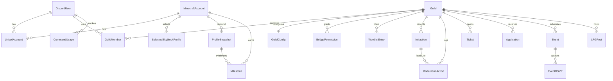

# Domain Model — SBR Guild Platform

The conceptual data model for the platform: entities, relationships, key fields, states, and what belongs in PostgreSQL (durable) versus Redis (ephemeral/derived). No schema code yet — this defines *what* we store and *why*.

**Conventions**
- Every persistent entity has `id` (uuid/cuid), `createdAt`, `updatedAt` unless noted.
- "FK" = foreign key reference. Soft-delete via `deletedAt` where audit/history matters.
- Timestamps are UTC.

---

## Entity Catalog (persistence at a glance)

| Entity | Store | Nature |
|--------|-------|--------|
| DiscordUser | Postgres | Persistent |
| MinecraftAccount | Postgres | Persistent |
| LinkedAccount | Postgres | Persistent (link is durable; verification is ephemeral) |
| Guild | Postgres | Persistent |
| GuildMember | Postgres | Persistent |
| SelectedSkyblockProfile | Postgres | Persistent (choice); live profile data is cached |
| GuildConfig | Postgres (cached in Redis) | Persistent |
| BridgePermission | Postgres (cached in Redis) | Persistent |
| Infraction | Postgres | Persistent (audit) |
| ModerationAction | Postgres | Persistent (audit) |
| WordlistEntry | Postgres (cached in Redis) | Persistent |
| Ticket | Postgres | Persistent |
| Application | Postgres | Persistent |
| Event | Postgres | Persistent |
| EventRSVP | Postgres | Persistent |
| LFGPost | Postgres (+ Redis TTL mirror) | Persistent record, ephemeral visibility |
| ProfileSnapshot | Postgres | Persistent (time-series) |
| Milestone | Postgres | Persistent |
| CommandUsage | Postgres (buffered via Redis) | Persistent (analytics) |
| WorkerJobLog | Postgres | Persistent (operational) |

---

## Entities

### Identity & Accounts

#### DiscordUser
Represents a Discord account known to the platform (member, staff, or applicant).

| Field | Notes |
|-------|-------|
| `id` | internal id |
| `discordId` | Discord snowflake, unique |
| `username`, `globalName` | cached from Discord |
| `avatarHash` | cached |
| `isStaff` | convenience flag; authoritative perms via roles |
| `lastSeenAt` | updated on interaction |

**Relationships:** 1—N `LinkedAccount`, 1—N `GuildMember`, 1—N `Ticket`, `Application`, `EventRSVP`, `LFGPost`, `CommandUsage`.

#### MinecraftAccount
A Minecraft/Hypixel account (by UUID), independent of who links it.

| Field | Notes |
|-------|-------|
| `id` | internal id |
| `uuid` | Mojang UUID, unique |
| `currentIgn` | latest known username (mutable upstream) |
| `ignHistoryCachedAt` | last name refresh |
| `hypixelLastFetchedAt` | rate-limit bookkeeping |

**Relationships:** 1—N `LinkedAccount`, 1—N `SelectedSkyblockProfile`, 1—N `ProfileSnapshot`, 1—N `Milestone`.

#### LinkedAccount
The join between a DiscordUser and a MinecraftAccount, with verification state.

| Field | Notes |
|-------|-------|
| `discordUserId` | FK |
| `minecraftAccountId` | FK |
| `status` | see enum |
| `verificationMethod` | e.g. Hypixel Discord field |
| `isPrimary` | one primary link per Discord user |
| `verifiedAt` | when confirmed |

**Enum — `LinkStatus`:** `PENDING`, `VERIFIED`, `REJECTED`, `UNLINKED`.
**Relationships:** N—1 `DiscordUser`, N—1 `MinecraftAccount`. Unique on (`discordUserId`,`minecraftAccountId`).
*Note:* the durable link lives here; the short-lived verification challenge/code lives in **Redis**.

---

### Guild & Membership

#### Guild
A managed community (Hypixel guild ↔ Discord server pairing).

| Field | Notes |
|-------|-------|
| `id` | internal id |
| `hypixelGuildId` | Hypixel guild id, unique/nullable |
| `name`, `tag` | display |
| `discordGuildId` | Discord server snowflake |
| `status` | see enum |

**Enum — `GuildStatus`:** `ACTIVE`, `SUSPENDED`, `ARCHIVED`.
**Relationships:** 1—1 `GuildConfig`; 1—N `GuildMember`, `BridgePermission`, `WordlistEntry`, `Event`, `LFGPost`, `Ticket`, `Application`, `Infraction`, `ModerationAction`.

#### GuildMember
A DiscordUser's membership in a specific Guild (roles/rank/status scoped per guild).

| Field | Notes |
|-------|-------|
| `guildId` | FK |
| `discordUserId` | FK |
| `guildRank` | in-game rank name (cached) |
| `role` | platform role, see enum |
| `status` | see enum |
| `joinedAt`, `leftAt` | membership window |

**Enum — `MemberRole`:** `MEMBER`, `MODERATOR`, `OFFICER`, `ADMIN`, `OWNER`.
**Enum — `MemberStatus`:** `ACTIVE`, `INACTIVE`, `LEFT`, `BANNED`.
**Relationships:** N—1 `Guild`, N—1 `DiscordUser`. Unique on (`guildId`,`discordUserId`).

#### SelectedSkyblockProfile
Which Skyblock profile a member currently tracks (the "cute name" / profile id).

| Field | Notes |
|-------|-------|
| `minecraftAccountId` | FK |
| `guildId` | FK (nullable — selection can be global) |
| `profileId` | Skyblock profile uuid |
| `cuteName` | e.g. "Mango" |
| `gameMode` | see enum |
| `isActive` | current selection |

**Enum — `SkyblockGameMode`:** `NORMAL`, `IRONMAN`, `STRANDED`, `BINGO`.
**Relationships:** N—1 `MinecraftAccount`. The *selection* is persistent; the *contents* of the profile are cached in Redis and snapshotted into `ProfileSnapshot`.

---

### Configuration & Permissions

#### GuildConfig
Per-guild settings and feature flags. Single row per guild; hot-read → cached in Redis.

| Field | Notes |
|-------|-------|
| `guildId` | FK, unique |
| `bridgeChannelId` | Discord channel for relay |
| `staffChannelId`, `logChannelId` | routing |
| `prefixes` | command prefixes |
| `features` | JSON feature-flag map |
| `cooldownDefaults` | JSON |
| `applicationsOpen` | bool |
| `timezone` | for events |

**Relationships:** 1—1 `Guild`.

#### BridgePermission
Who may do what through the chat bridge (e.g. run commands, use @mentions, bypass filters).

| Field | Notes |
|-------|-------|
| `guildId` | FK |
| `subjectType` | see enum (role vs user) |
| `subjectId` | role id / discord id / in-game rank |
| `capability` | see enum |
| `allow` | grant/deny |

**Enum — `PermSubjectType`:** `DISCORD_ROLE`, `DISCORD_USER`, `GUILD_RANK`.
**Enum — `BridgeCapability`:** `RELAY_MESSAGE`, `RUN_COMMAND`, `MENTION`, `BYPASS_FILTER`, `BYPASS_COOLDOWN`, `ADMIN`.
**Relationships:** N—1 `Guild`. Effective permissions cached in Redis for fast checks.

**Resolution order** (`packages/identity`): explicit deny → explicit grant (an `ADMIN`
grant carries every capability) → **`GuildMember.role` floor**. The floor exists because
this table starts empty: a freshly onboarded guild has no rows, so resolving from rows
alone would deny every command to everyone including the owner. Floors are
`RELAY_MESSAGE`/`RUN_COMMAND` → `MEMBER`, `MENTION` → `MODERATOR`, `BYPASS_COOLDOWN` →
`OFFICER`, `BYPASS_FILTER`/`ADMIN` → `ADMIN`. Deny is checked first so a capability can be
taken from someone who holds it by rank without demoting them. Only `DISCORD_USER` rows
are resolved today — `DISCORD_ROLE` and `GUILD_RANK` subjects need the caller's Discord
roles or in-game rank, which the check does not yet receive.

#### WordlistEntry
Filter/wordlist rules for bridge content moderation.

| Field | Notes |
|-------|-------|
| `guildId` | FK |
| `pattern` | literal or regex |
| `matchType` | see enum |
| `action` | see enum |
| `severity` | int / tier |
| `enabled` | bool |

**Enum — `WordMatchType`:** `EXACT`, `SUBSTRING`, `REGEX`, `WILDCARD`.
**Enum — `WordAction`:** `BLOCK`, `FLAG`, `REPLACE`, `SHADOW_MUTE`.
**Relationships:** N—1 `Guild`. Compiled wordlist cached in Redis for per-message checks.

---

### Moderation & Support

#### Infraction
A recorded offense against a member (the "what happened"). Distinct from the action taken.

| Field | Notes |
|-------|-------|
| `guildId` | FK |
| `targetDiscordUserId` | FK (nullable if in-game only) |
| `targetMinecraftAccountId` | FK (nullable) |
| `type` | see enum |
| `severity` | see enum |
| `reason` | text |
| `sourceContext` | where it happened (bridge/discord/ingame) |
| `status` | see enum |

**Enum — `InfractionType`:** `SPAM`, `PROFANITY`, `HARASSMENT`, `ADVERTISING`, `CHEATING`, `RULE_BREAK`, `OTHER`.
**Enum — `InfractionSeverity`:** `LOW`, `MEDIUM`, `HIGH`, `CRITICAL`.
**Enum — `InfractionStatus`:** `OPEN`, `ACTIONED`, `EXPIRED`, `APPEALED`, `OVERTURNED`.
**Relationships:** N—1 `Guild`; 1—N `ModerationAction`.

#### ModerationAction
An action a staff member took (possibly in response to an Infraction).

| Field | Notes |
|-------|-------|
| `guildId` | FK |
| `infractionId` | FK (nullable — proactive actions) |
| `actorDiscordUserId` | FK (staff who acted) |
| `targetDiscordUserId` / `targetMinecraftAccountId` | FK |
| `type` | see enum |
| `reason` | text |
| `durationSeconds` | for temp actions (nullable) |
| `expiresAt` | computed |
| `active` | currently in effect |

**Enum — `ModActionType`:** `WARN`, `MUTE`, `UNMUTE`, `KICK`, `BAN`, `UNBAN`, `NOTE`, `ROLE_CHANGE`, `GUILD_EXPEL`.
**Relationships:** N—1 `Guild`, N—1 `Infraction`. Append-only audit log.
*Note:* the durable record is in Postgres; the *live enforcement state* (e.g. active mute + TTL) is mirrored in Redis for fast checks.

#### Ticket
A support/help thread opened by a user.

| Field | Notes |
|-------|-------|
| `guildId` | FK |
| `openerDiscordUserId` | FK |
| `assigneeDiscordUserId` | FK (nullable) |
| `category` | see enum |
| `status` | see enum |
| `channelId` | Discord thread/channel |
| `closedAt`, `closeReason` | resolution |

**Enum — `TicketCategory`:** `SUPPORT`, `REPORT`, `APPEAL`, `APPLICATION`, `OTHER`.
**Enum — `TicketStatus`:** `OPEN`, `PENDING`, `RESOLVED`, `CLOSED`.
**Relationships:** N—1 `Guild`, N—1 `DiscordUser`.

#### Application
A guild-join application submitted by a user.

| Field | Notes |
|-------|-------|
| `guildId` | FK |
| `applicantDiscordUserId` | FK |
| `minecraftAccountId` | FK (nullable until linked) |
| `answers` | JSON (question→answer) |
| `status` | see enum |
| `reviewerDiscordUserId` | FK (nullable) |
| `decisionReason` | text |
| `submittedAt`, `decidedAt` | lifecycle |

**Enum — `ApplicationStatus`:** `DRAFT`, `SUBMITTED`, `UNDER_REVIEW`, `ACCEPTED`, `REJECTED`, `WITHDRAWN`.
**Relationships:** N—1 `Guild`, N—1 `DiscordUser`.

---

### Community & Engagement

#### Event
A scheduled community event.

| Field | Notes |
|-------|-------|
| `guildId` | FK |
| `title`, `description` | display |
| `type` | see enum |
| `startsAt`, `endsAt` | schedule |
| `capacity` | nullable |
| `hostDiscordUserId` | FK |
| `status` | see enum |
| `messageId` | announcement message |

**Enum — `EventType`:** `DUNGEON`, `SLAYER`, `FISHING`, `MINING`, `GIVEAWAY`, `MEETING`, `CUSTOM`.
**Enum — `EventStatus`:** `SCHEDULED`, `LIVE`, `COMPLETED`, `CANCELLED`.
**Relationships:** N—1 `Guild`; 1—N `EventRSVP`.

#### EventRSVP
A user's response to an event.

| Field | Notes |
|-------|-------|
| `eventId` | FK |
| `discordUserId` | FK |
| `state` | see enum |
| `respondedAt` | timestamp |

**Enum — `RSVPState`:** `GOING`, `MAYBE`, `NOT_GOING`, `WAITLIST`.
**Relationships:** N—1 `Event`, N—1 `DiscordUser`. Unique on (`eventId`,`discordUserId`).

#### LFGPost
A "looking for group" post (carry, dungeon party, etc.).

| Field | Notes |
|-------|-------|
| `guildId` | FK |
| `authorDiscordUserId` | FK |
| `activity` | see enum |
| `details` | text |
| `slotsTotal`, `slotsFilled` | party size |
| `status` | see enum |
| `expiresAt` | auto-expiry |

**Enum — `LFGActivity`:** `DUNGEONS`, `SLAYERS`, `KUUDRA`, `FISHING`, `MINING`, `OTHER`.
**Enum — `LFGStatus`:** `OPEN`, `FULL`, `EXPIRED`, `CLOSED`.
**Relationships:** N—1 `Guild`, N—1 `DiscordUser`.
*Note:* durable record in Postgres, but active/open posts are mirrored in Redis with a TTL so expiry and live listings are cheap.

---

### Progression & Analytics

#### ProfileSnapshot
A point-in-time capture of a Skyblock profile's stats (time-series for progression tracking).

| Field | Notes |
|-------|-------|
| `minecraftAccountId` | FK |
| `profileId` | Skyblock profile uuid |
| `capturedAt` | timestamp (indexed) |
| `networth` | numeric |
| `skillAverages` | JSON |
| `slayerXp`, `catacombsLevel`, etc. | JSON blob of tracked metrics |
| `source` | see enum |

**Enum — `SnapshotSource`:** `SCHEDULED`, `ON_DEMAND`, `EVENT_TRIGGERED`, `BACKFILL`.
**Relationships:** N—1 `MinecraftAccount`. Append-only; drives milestone detection and progression charts.

#### Milestone
A recognized achievement/threshold crossed by a member.

| Field | Notes |
|-------|-------|
| `minecraftAccountId` | FK |
| `guildId` | FK (nullable) |
| `type` | see enum |
| `metric`, `thresholdValue` | what/how much |
| `achievedAt` | timestamp |
| `snapshotId` | FK (evidence, nullable) |
| `announced` | bool |

**Enum — `MilestoneType`:** `SKILL_LEVEL`, `CATACOMBS_LEVEL`, `SLAYER_TIER`, `NETWORTH_THRESHOLD`, `COLLECTION`, `CUSTOM`.
**Relationships:** N—1 `MinecraftAccount`, N—1 `ProfileSnapshot`.

#### CommandUsage
A record of a command invocation (usage analytics + rate-limit auditing).

| Field | Notes |
|-------|-------|
| `guildId` | FK (nullable) |
| `discordUserId` | FK (nullable) |
| `surface` | see enum |
| `command` | name |
| `args` | sanitized JSON |
| `success` | bool |
| `latencyMs` | perf |
| `invokedAt` | timestamp (indexed) |

**Enum — `CommandSurface`:** `BRIDGE_BOT`, `ADMIN_BOT`, `WEB_PANEL`, `INGAME`.
**Relationships:** N—1 `Guild`, N—1 `DiscordUser`.
*Note:* high-volume — write-buffered in Redis (list/stream) and flushed to Postgres in batches by workers.

#### WorkerJobLog
Operational record of a background job run.

| Field | Notes |
|-------|-------|
| `queue` | queue name |
| `jobId` | BullMQ id |
| `type` | job type |
| `status` | see enum |
| `attempts` | count |
| `startedAt`, `finishedAt` | timing |
| `error` | text (nullable) |
| `resultSummary` | JSON (nullable) |

**Enum — `JobStatus`:** `QUEUED`, `ACTIVE`, `COMPLETED`, `FAILED`, `RETRYING`, `CANCELLED`.
**Relationships:** standalone (may reference target entities by id in `resultSummary`).
*Note:* live queue/job state lives in Redis (BullMQ); this table is the durable audit/history written on completion.

---

## Relationship Overview

---

## Persistent vs. Ephemeral — Guidance

- **Always persistent (source of truth in Postgres):** DiscordUser, MinecraftAccount, LinkedAccount, Guild, GuildMember, GuildConfig, BridgePermission, WordlistEntry, Infraction, ModerationAction, Ticket, Application, Event, EventRSVP, ProfileSnapshot, Milestone, WorkerJobLog. These are records of fact, audit, or configuration.
- **Persistent record + ephemeral live-state mirror in Redis:**
  - `ModerationAction` → active mute/ban with TTL for fast enforcement checks.
  - `LFGPost` → open posts with TTL for live listings + auto-expiry.
  - `GuildConfig`, `BridgePermission`, `WordlistEntry` → cached compiled/effective values for hot-path reads.
- **Buffered then persisted:** `CommandUsage` (Redis stream/list → batched Postgres writes).
- **Purely ephemeral (never in Postgres):** verification challenges, cooldown counters, rate-limit windows, distributed locks, OAuth/session state, in-flight command interactions, live Skyblock profile payload cache, BullMQ live job state.

---

## Redis Key Categories

| Category | Key pattern (illustrative) | Stores | TTL |
|----------|---------------------------|--------|-----|
| **Cache — Hypixel/profile** | `cache:hypixel:profile:{uuid}:{profileId}` | Normalized live Skyblock profile payload | minutes |
| **Cache — pricing** | `cache:pricing:{itemId}` / `cache:bazaar` | Computed item/bazaar prices | short |
| **Cache — config** | `cfg:guild:{guildId}` | Effective GuildConfig snapshot | until invalidated |
| **Cache — permissions** | `perm:guild:{guildId}` | Compiled effective BridgePermissions | until invalidated |
| **Cache — wordlist** | `wordlist:guild:{guildId}` | Compiled filter rules | until invalidated |
| **Cooldowns** | `cd:{surface}:{command}:{userId}` | Cooldown/rate-limit windows | seconds–minutes |
| **Locks** | `lock:{resource}` (e.g. `lock:stats-sync:{uuid}`) | Distributed mutex for workers/critical sections | short, auto-expire |
| **Sessions** | `sess:{sessionId}` | Web panel OAuth session / user context | hours |
| **Verification** | `verify:link:{discordUserId}` | Pending account-link challenge/code | minutes |
| **Enforcement state** | `mute:{guildId}:{userId}`, `ban:{guildId}:{userId}` | Active mute/ban mirror for fast checks | = action duration |
| **LFG live** | `lfg:open:{guildId}` (set) + `lfg:{postId}` | Open post ids + payload for live listing/expiry | = post lifetime |
| **Queues (BullMQ)** | `bull:{queueName}:*` | Job queues, delayed/repeatable jobs, job state | managed by BullMQ |
| **Event dispatch (pub/sub)** | `chan:bridge:{guildId}`, `chan:events` | Cross-instance relay + domain event fan-out | n/a (pub/sub) |
| **Analytics buffer** | `buf:command-usage` (stream/list) | Un-flushed CommandUsage records | until flushed |
| **Rate-limit — external** | `rl:hypixel` | Hypixel API request budget/window | rolling window |

---

## Notes & Open Decisions

- **DiscordUser vs GuildMember split** lets one Discord user belong to multiple guilds with distinct roles/status — keep global identity separate from per-guild membership.
- **Infraction vs ModerationAction split** cleanly separates "what happened" from "what staff did," supporting proactive actions (no infraction) and multiple actions per infraction (warn → later ban).
- **ProfileSnapshot** is deliberately time-series and append-only; retention/rollup policy (e.g. keep dailies, thin older) is a worker concern to decide later.
- **CommandUsage** volume argues for buffering; if volume is low in v1, direct writes are acceptable and the buffer can be added later.
- **SelectedSkyblockProfile** guild-scoping is nullable so selection can be global or per-guild — confirm which the product wants before schema.
