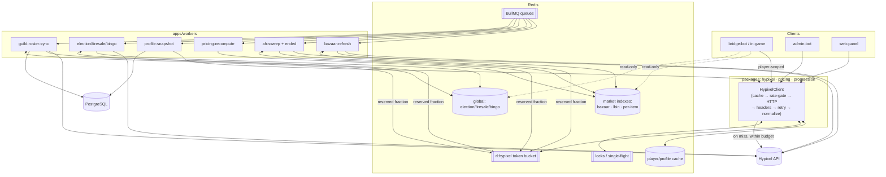

# Hypixel Data Layer — SBR Guild Platform

How the platform talks to Hypixel. Every Hypixel call flows through **one** centralized client in `packages/hypixel`; nothing else in the codebase touches the API directly. The client owns caching, retries, rate-limit awareness, typed errors, and normalization. Domain packages (`pricing`, `progression`) and apps consume **typed DTOs + fallback states**, never raw payloads.

**Non-negotiables (from the constraints)**
- Centralized client; read & respect rate-limit headers.
- Never paginate the auction house inside a live command handler — **workers ingest, commands read cache**.
- Bazaar uses **quick-status** pricing where appropriate.
- Missing profile fields are **unknown/null**, never coerced to `0`.
- Partial networth is **never presented as exact**.
- Explicit fallback states: `API_DISABLED`, `STALE`, `MISSING_PROFILE`, `NOT_LINKED`, `RATE_LIMITED`.

---

## 1. The Centralized Client

`packages/hypixel` exposes a single `HypixelClient` with one code path for every request:

```
request → cache lookup → (miss) rate-limit gate → HTTP → header ingest
        → retry/backoff on transient → normalize → cache set → typed result
```

Responsibilities, in order:
1. **Cache lookup** (Redis) — return fresh cache immediately; return *stale* cache tagged `STALE` if the source is currently unavailable.
2. **Rate-limit gate** — a Redis token bucket keyed `rl:hypixel` reflecting the API budget. If no token is available, either queue (workers) or **fail fast with `RATE_LIMITED`** (live handlers). Never block a command indefinitely.
3. **HTTP call** with timeout.
4. **Header ingest** — read `RateLimit-Limit`, `RateLimit-Remaining`, `RateLimit-Reset` (and `Retry-After` on 429) and update the token bucket to match reality, not a guess.
5. **Retry/backoff** — retry only *transient* failures (5xx, timeouts, 429) with exponential backoff + jitter; **never** retry 4xx auth/permission errors.
6. **Normalize** — map raw JSON to typed DTOs; convert absent fields to `null`/`unknown`, not `0`.
7. **Cache set** with an endpoint-appropriate TTL and return a `Result<DTO, HypixelError>`.

All methods return a discriminated result — success carries data + `freshness` (`LIVE`/`STALE`) + `fetchedAt`; failure carries one of the typed fallback states below.

---

## 2. Data Acquisition Plan

### Endpoint classification — **Live** vs **Background-only**

| Endpoint | Class | Why | Cadence / TTL |
|----------|-------|-----|---------------|
| `player` | **Live** (cached) | Single small object; needed on demand | Cache 5–10 min |
| `skyblock/profiles` (by player) | **Live** (cached) | Per-player, bounded size; powers stats/networth | Cache 3–5 min |
| `skyblock/profile` (single) | **Live** (cached) | Same | Cache 3–5 min |
| `skyblock/museum` (per profile) | **Live** (cached, on-demand) | Needed for accurate networth; separate call | Cache 10 min |
| `guild` (by id/player) | **Live** (cached) + periodic worker refresh | Roster/rank sync | Cache 5 min; worker every 5–15 min |
| `resources/*` (skills, collections, items, election) | **Live-ish, long cache** | Static-ish reference data | Cache hours; worker daily refresh |
| `skyblock/bazaar` | **Background-primary** (quick-status) | One big object, high churn; serve from cache | Worker every 30–60 s → cache; commands read cache |
| `skyblock/auctions` (paginated AH) | **Background-ONLY** | Hundreds of pages; must never run in a handler | Worker full sweep every 3–5 min → derived indexes |
| `skyblock/auctions_ended` | **Background-only** | Sold-price signal for valuations | Worker every 1–2 min |
| `skyblock/election` / mayor | **Background-primary** | Global, slow-changing | Worker every few min → cache; commands read cache |
| `skyblock/firesales` | **Background-primary** | Global, slow-changing | Worker periodic → cache |
| `skyblock/bingo` (+ resources) | **Background-primary** | Global event data | Worker periodic → cache |

**Rule of thumb:** *per-player, bounded* endpoints are **Live (cached on demand)**; *global, large, or paginated* datasets (AH, bazaar, election, firesales, bingo) are **worker-owned** and commands only ever read the derived cache.

### Player-scoped acquisition flow (live command)
1. Resolve identity: Discord user → `LinkedAccount` → UUID + selected `profileId`. No link → `NOT_LINKED`.
2. Cache lookup for the profile DTO. Hit + fresh → return `LIVE`.
3. Miss → rate-limit gate → fetch `skyblock/profile` (+ `museum` if the command needs networth). Respect headers.
4. Normalize; if the profile's API toggles (inventory/skills/etc.) are off, mark those sections `API_DISABLED` and leave values `null`.
5. Cache and return with `freshness`.

### Market/global acquisition flow (live command)
- Commands (`/price`, `/bazaar`, `/lowestbin`, `/auctions`, `/mayor`, `/firesales`, `/bingo`) **read pre-computed Redis keys only**. If the key is missing/expired → `STALE` (serve last-known) or `MISSING_PROFILE`-style empty state; they **never** trigger an AH sweep.

---

## 3. Cache Strategy

Redis is the single cache tier (see `DOMAIN_MODEL.md` Redis categories). Keys carry the data plus metadata (`fetchedAt`, `freshness`, `source`) so consumers can render "as of Xm ago" and detect staleness.

| Data | Key (illustrative) | TTL | Populated by | Notes |
|------|--------------------|-----|--------------|-------|
| Player object | `cache:hypixel:player:{uuid}` | 5–10 min | Live (on demand) | Small; cheap to refresh |
| Skyblock profile | `cache:hypixel:profile:{uuid}:{profileId}` | 3–5 min | Live (on demand) | Per-selected-profile |
| Museum | `cache:hypixel:museum:{profileId}` | 10 min | Live (on demand) | Only fetched for networth |
| Guild | `cache:hypixel:guild:{guildId}` | 5 min | Live + worker | Roster/rank |
| Resources (skills/items/etc.) | `cache:hypixel:res:{name}` | 6–24 h | Worker (daily) | Reference data |
| Bazaar quick-status | `cache:pricing:bazaar` | 60–90 s | Worker (30–60 s) | Whole snapshot; per-item derived below |
| Per-item price | `cache:pricing:item:{itemId}` | 2–5 min | Worker (derived) | Blends bazaar + BIN + sold |
| Lowest BIN index | `cache:ah:lbin:{itemId}` | 3–5 min | Worker (AH sweep) | Derived from sweep |
| Player auctions | `cache:ah:player:{uuid}` | 3–5 min | Worker (AH sweep) | Derived index |
| Election / mayor | `cache:sb:election` | 5–10 min | Worker | Global |
| Firesales | `cache:sb:firesales` | 5 min | Worker | Global |
| Bingo | `cache:sb:bingo` | 10 min | Worker | Global |

**Cache policies**
- **TTL + stale-while-revalidate:** on a near-expiry hit, serve the cached value immediately and enqueue a background refresh (for player-scoped) rather than blocking the caller.
- **Stale-if-error:** if a live refresh fails (5xx/`RATE_LIMITED`/timeout), return the last cached value tagged `STALE` instead of erroring, as long as it exists.
- **Single-flight / lock:** concurrent misses for the same key coalesce behind a Redis lock (`lock:hypixel:{key}`) so we don't fan out N identical upstream calls.
- **Negative caching:** `API_DISABLED` and `MISSING_PROFILE` results are cached briefly (30–60 s) to avoid hammering the API for known-bad reads.
- **Derived, not raw, for market data:** the AH sweep writes *indexes* (lowest-BIN map, per-player map, per-item aggregates), never raw pages, so commands read O(1) keys.

---

## 4. Worker Sync Strategy

`apps/workers` (BullMQ on Redis) owns everything large, global, or paginated. Each job type has a repeatable schedule, a distributed lock to prevent overlap, and writes a `WorkerJobLog` on completion.

| Job | Schedule | Lock | Output | Failure handling |
|-----|----------|------|--------|------------------|
| `bazaar-refresh` | 30–60 s | `lock:job:bazaar` | `cache:pricing:bazaar` + per-item derived | Keep last snapshot; log; alert on repeated fail |
| `ah-sweep` | 3–5 min | `lock:job:ah-sweep` | lowest-BIN index, per-player index, per-item aggregates | **Atomic swap** — build into shadow keys, promote on success; never partial |
| `ah-ended-ingest` | 1–2 min | `lock:job:ah-ended` | sold-price feed → into pricing blend | Idempotent by auction id |
| `pricing-recompute` | after bazaar/ah | `lock:job:pricing` | `cache:pricing:item:*` (blend bazaar+BIN+sold) | Recompute from latest indexes |
| `guild-roster-sync` | 5–15 min | `lock:job:guild:{id}` | Guild roster/ranks → DB + cache | Diff-based; reconciles `GuildMember` |
| `profile-snapshot` | scheduled/backfill | `lock:job:snapshot:{uuid}` | `ProfileSnapshot` rows + milestone detection | Rate-limit-aware queue; spread over window |
| `resources-refresh` | daily | `lock:job:resources` | `cache:hypixel:res:*` | Static-ish; safe to retry |
| `election/firesale/bingo-refresh` | few min | per-job lock | global caches | Serve last on failure |

**AH sweep specifics (the critical one):**
- Runs **only** in workers. Reads `RateLimit-Remaining`/`Reset`, paces page fetches to stay under budget, and yields tokens to live traffic (the token bucket is shared, but the sweep uses a *reserved fraction* so it can't starve commands).
- Builds indexes into **shadow keys**, then does an atomic promote (rename/pointer swap) so readers never see a half-built index.
- If a sweep can't complete within budget, it promotes what it has only if consistent, else keeps the previous good index and flags `STALE`.

**Snapshot / rate-budget cooperation:** heavy per-player jobs (snapshots, backfills) run through a **queue that consumes the same `rl:hypixel` budget** but at low priority, so on-demand commands always win the token.

---

## 5. Fallback / Error Model

Every `HypixelClient` method returns a typed result. Fallback states are first-class and propagate into DTOs so commands render honest, specific messages.

| State | Meaning | Trigger | Command behavior |
|-------|---------|---------|------------------|
| `NOT_LINKED` | Caller/target has no verified `LinkedAccount` | Identity resolution before any API call | Prompt to `/link`; public lookups may still proceed by IGN |
| `MISSING_PROFILE` | UUID valid but no such Skyblock profile / no data | 404-equivalent / empty | "No profile data found"; suggest `/setprofile` |
| `API_DISABLED` | Player toggled an API section off (inventory/skills/etc.) | Section absent while profile present | Show what's available; mark disabled sections; **exclude from networth exactness** |
| `STALE` | Serving cached data because live is unavailable | Live fetch failed but cache exists | Show data + "as of Xm ago (stale)" note |
| `RATE_LIMITED` | No token available / upstream 429 | Rate-limit gate or `Retry-After` | Fail fast with retry hint; live handlers never block on the bucket |
| *(success)* `LIVE` | Fresh authoritative data | Normal | Render normally |

**Data-integrity rules baked into normalization:**
- **Unknown ≠ zero.** Absent fields become `null`/`undefined` in DTOs. A hidden inventory yields `null` networth components, not `0`.
- **Networth honesty.** If *any* component that materially affects networth is missing/`API_DISABLED` (inventory, museum, etc.), the result is flagged **`partial`** and rendered as an **estimate/lower-bound** ("≥ X, some data hidden"), never as an exact figure. Only a fully-readable profile yields an "exact" label.
- **Typed errors, not exceptions across boundaries.** Transport/HTTP errors are caught in the client and converted to the states above; domain packages branch on state, not try/catch.
- **Retry policy:** transient (5xx/timeout/429) → backoff+jitter, capped attempts; permanent (401/403/400) → immediate typed failure, no retry, log for config review (bad/missing API key).

---

## 6. Data Flow Diagram



**Reading the diagram:** live command handlers only ever touch **player/profile cache** and, on a fresh miss, the API through the rate gate. Market and global data (bazaar, AH, election, firesale, bingo) are **written by workers** into Redis indexes and **read-only** for commands — the AH is never paged in a handler. The shared `rl:hypixel` token bucket keeps live traffic and worker sweeps under the real limit, with workers reserved a fraction so they can't starve commands.

---

## 7. Summary of Decisions

- **One client, one path.** Cache→gate→HTTP→headers→retry→normalize, returning typed results with `freshness`.
- **Live = per-player & bounded** (`player`, `profile`, `museum`, `guild`). **Background-only = global/large/paginated** (`auctions`, `auctions_ended`, `bazaar`, `election`, `firesales`, `bingo`).
- **Bazaar via quick-status**, refreshed by a worker every 30–60 s; commands read the snapshot.
- **AH ingested by a worker sweep** into atomically-swapped indexes; **never** paged in a command.
- **Rate limits driven by real headers** into a shared Redis token bucket; live traffic prioritized, workers reserved a fraction.
- **Honest data:** unknown≠zero, partial networth is an estimate/lower-bound, and every result carries an explicit state (`NOT_LINKED`/`MISSING_PROFILE`/`API_DISABLED`/`STALE`/`RATE_LIMITED`/`LIVE`).
